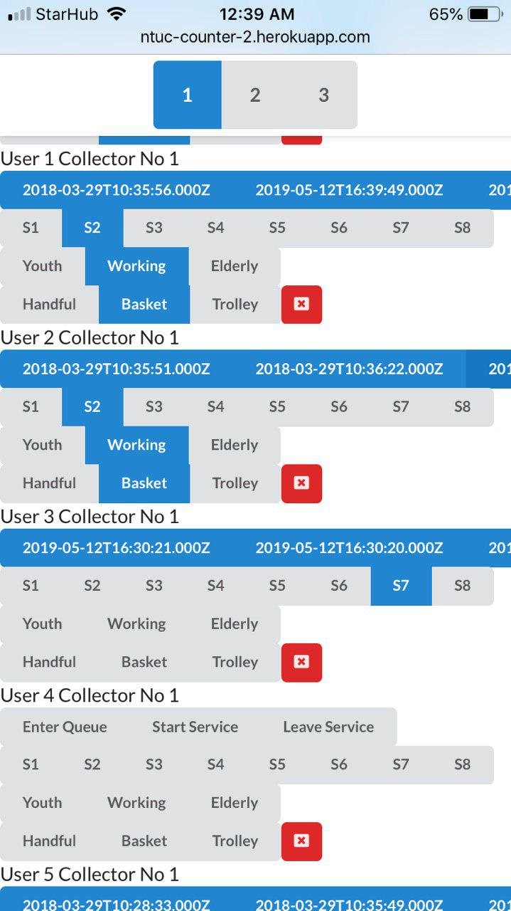
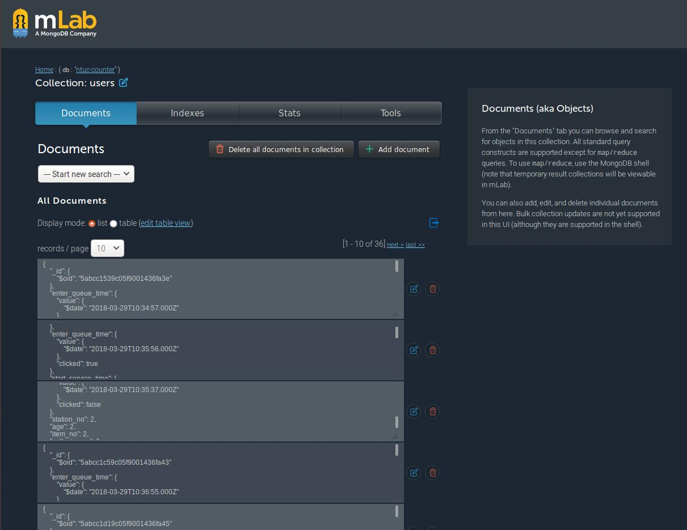
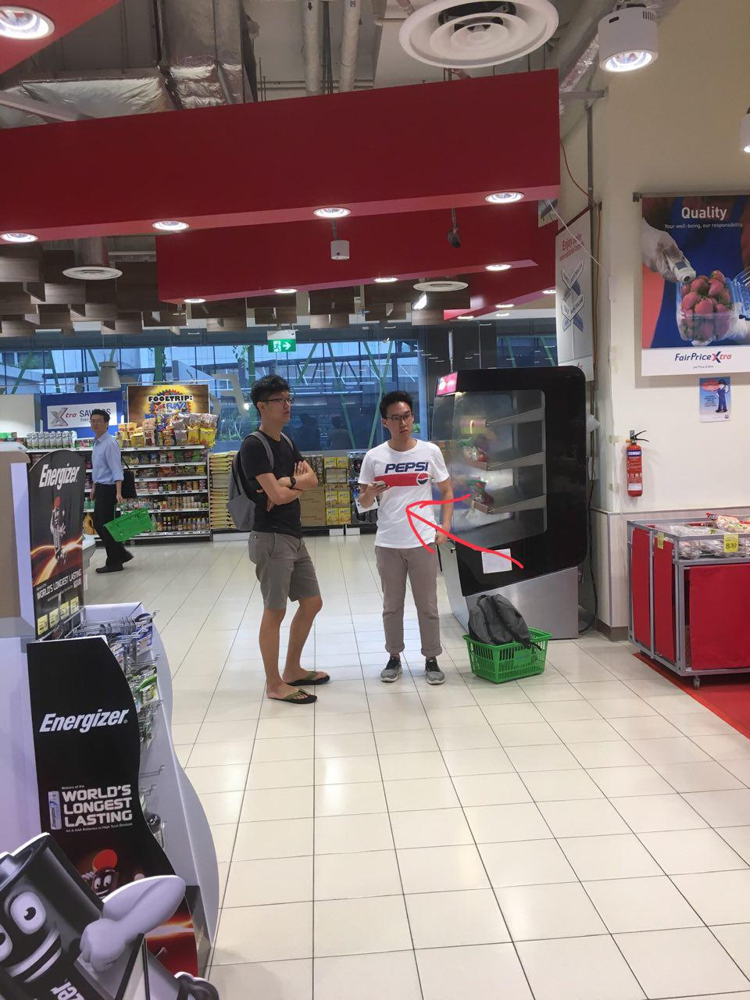

# NTUC Counter 2

**Team Members:** Shawn, Huai Kang, Steven, Neel, Kevan

## Why?
This application was a tool created for our Manufacturing and Service Operations class. The task for the project was to look for an industry partner and help them analyse their processes using queueing theory. Because the company we initially chose was a poor fit for the project, we pivoted near the end and decided to analyse the difference between self-service and staffed counters at a nearby supermarket (NTUC) instead. 

By the time we pivoted, it was already too late into the semester to go through the whole process of engaging a company, discussing the scope of the project, and procuring sanitised data from their engineers. Hence, we decided to collect the data ourselves by hand. At first, we thought of using an Excel spreadsheet, since there was a keyboard shortcut that allowed us to timestamp a cell pretty quickly. This way, we'd be able to keep track of the time each customer joins the queue, starts service and finishes getting served. However, this would require a computer, which would attract the attention of the staff. In order to be discreet about it, we wanted to be able to use our phone to record the data, which led me to creating this tool. 

## Technologies Used

The structure of the project can be divided as follows. The frontend and backend code both sit in the same repository but when deployed to Heroku, the backend is initialise and serves the static files in the `/build` folder as the frontend.

#### Frontend
The frontend was created with React. The nature of this tool required us to keep track of the state of the application. When multiple customers are updated, or when multiple buttons are clicked (demographic, amount of groceries, counter number), the user input has to be resolved in such a way that no input data is lost, which was easier to do in React. 

Because each button the user clicks sends an API call to update the database, I used Axios to make the calls so that the user can continue making inputs even though it's still waiting for the response from the first call. Coupled with React's local state management that updates the button the moment it's clicked, the application feels fast and can take its time to update the database without interrupting the flow of data entry. 

#### Backend
The backend was done with Express.js and was a basic API that handled tasks like creating new records, updating the records, deleting the records and displaying all the current records.

#### Data Analysis
Once the data was in mLab, we could pull the records out in the JSON format by making an API call to the backend from a Python script. We then saved it to a `.csv` file for further data analysis with Pandas. 

## Screenshots

### Application used by team members for data collection

### Data stored on mLab

### Teammates (discreetly) collecting data at the supermarket
